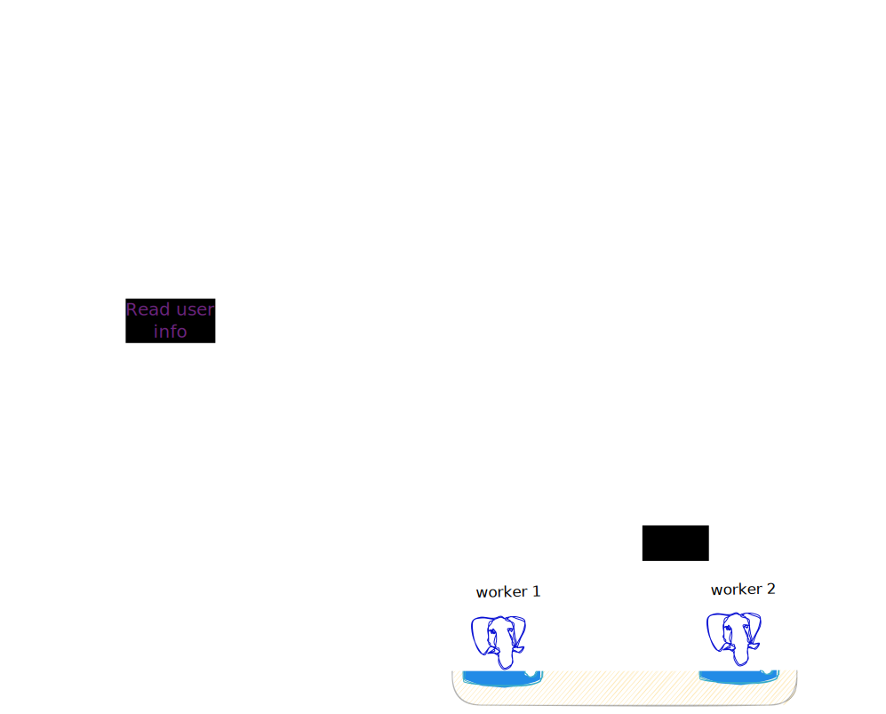
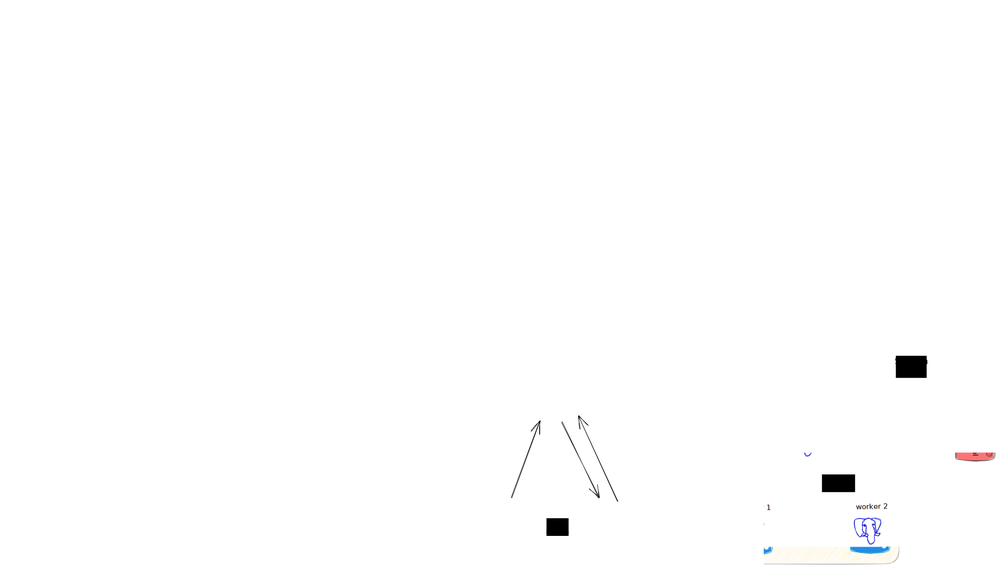

Концептуальная архитектура сервиса выглядела до выделение сервисов так:



После разделения на общую часть и сервис диалогов архитектура выглядит так:



Для запуска приложения с шардированием нужно выполнить несколько действий после запуска docker-compose.
Для задачи с диалогами были созданы две таблицы:

1) messages
2) chats

Первую будем шардировать, а вторую среплицируем на все воркеры.

1. Подключаемся к мастеру:

   ```bash
   docker exec -it socialnethl_master psql -U postgres
   ```

2. Создадим референсную таблицу для чатов:

   ```sql
   select create_reference_table('chats');
   ```

2. Создадим распределенную таблицу для диалогов:

   ```sql
   SELECT create_distributed_table('messages', 'chat_id');
   ```

   Ключом для шардирования будет идентификатор чата. Т.е. все чаты не зависимо чьи они (Леди Гаги или простого пользака) будут равномерно распределяться по ключу чата.

3. После этого включим логическую репликацию:

   ```sql
   alter system set wal_level = logical;
   SELECT run_command_on_workers('alter system set wal_level = logical');
   ```

4. Перезапустим контейнеры:

   ```bash
   docker-compose restart
   ```

5. Если нужно будет сделать ребалансировку, то на мастере нужно выполнить команду:

   ```sql
   docker exec -it socialnethl_master psql -U postgres
   
   SELECT citus_rebalance_start();
   ```

   